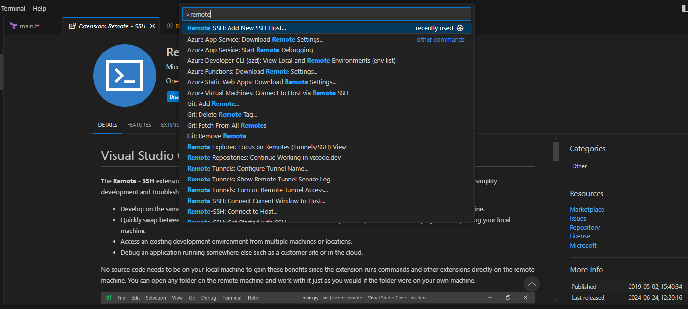

# Dev-enviroment-docker

## To start the backend and install the hashicorp/azurerm version

```terraform init```

## Install Remote-SSH from Microsoft on VSCode



## Step to apply changes

1. ```terraform fmt```
2. ```terraform plan```
3. ```terraform apply -auto-approve```

### Generate a SSH key

```ssh-keygen -t rsa```

```C:\Users\YourUSER/.ssh/mtcazurekey```

### Get the public_ip_address

1. ```terraform state show azurerm_linux_virtual_machine.mtc-vm```
2. <strong>Search for public_ip_address and copy that</strong>
3. ```ssh - i ~/.ssh/mtcazurekey adminuser@IPAddressYouCopied```
4. ```exit```